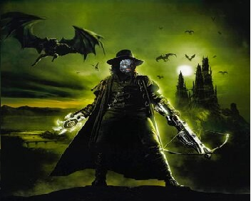

# Marías Marcel Lupei, el Herrero Herrante

## Estadísticas clave
* AC 22
* HP 59
* Dificultad hechizos: 15
* Bonus ataque hechizos: +7
* Hechizo ofensivo principal: llama sagrada, salvación de DEX a dif 15 o 2d8 de daño radiante.
* Hechizo curativo principal: healing word, (1d4*nivel de hechizo)+4 como acción bonus.

## Salvaciones
| STR | DEX | CON | INT | WIS | CHAR |
| --- | --- | --- | --- | --- | --- |
| 0 | 3 | 3 | 1 | 7 | 3 | 

## Habilidades
Proficiency +3 con: history, investigation, persuasion, survival.
Desventaja en sigilo por armadura.

## Objetos útiles
- 3 zombies con [las siguientes estadísticas](https://roll20.net/compendium/dnd5e/Zombie#content).
- Grilletes
- Poción de curación
- Vendas
- Pala
- Antiveneno del carromato de Ezmeralda

## Hechizos

### Nivel 1
**Usados/Total: 0 / 4**
* Castigo abrasador
* Identify
* Detect magic
* Healing word
* Inflict wounds
* Cure wounds

### Nivel 2
**Usados/Total: 0 / 3**
* Arma mágica
* Heat metal
* Inmovilizar persona
* Prayer of healing
* Silence

### Nivel 3
**Usados/Total: 0 / 3**
* Arma elemental
* Protección vs energía
* Mass healing
* El beacon de la esperanza
* Animate dead

### Nivel 4
**Usados/Total: 0 / 2**
* Fabricate
* Wall of fire
* Stone shape
* Death ward

### Nivel 7
* Finger of Death

### Nivel $\infty$
* Superresurrección

